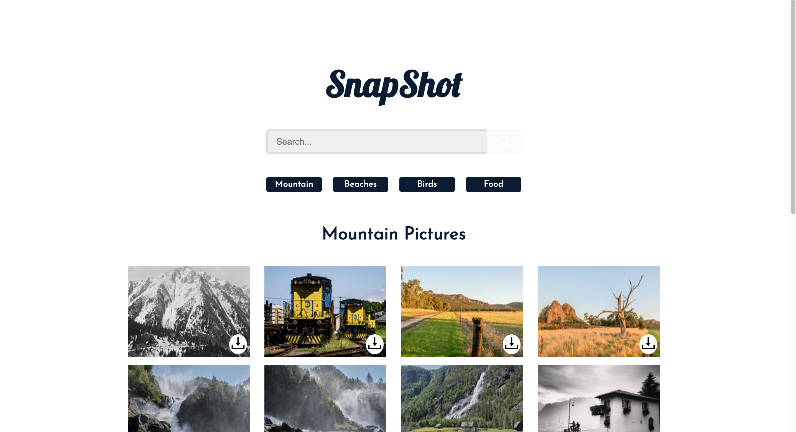

<h1 style="text-align: center;">Snap Shot </h1>

### Summary

This is a legacy project adding Typescript and new features to an open source application.
This app was originally created using React,React Hooks, React Router and Context API. The Routes were setup for four default pages and a search page. Also the images were displayed using the Flickr API and axios to fetch data.

### Original demonstration and repository

[Demo of Snap Shot](https://yog9.github.io/SnapShot/)
[Repository](https://github.com/Yog9/SnapShot/tree/master)

### What I added

-   Added Typescript to original app which is created with React.js
-   Added download feature

### Motivation

The purpose of this project was to get familiar with how to add typescript to react.js app.

### Getting Started

Click the demo link or clone/download the repository on your local machine.
Create a config.js file in api folder inside src folders. In config.js file write
`export const apiKey = "YOUR_FLIKR_API_KEY";`

##### Install dependencies

`yarn install`

##### Run Snap Shot from the root directory.

`yarn start`

### Built With

-   Typescript
-   React js
-   React Router
-   React Hooks
-   Context API
-   Flickr API

### Features

**1. Responsive Design.**

**2. Search functionality added to search photos from API.**

**3. Download images to your local PC.**

